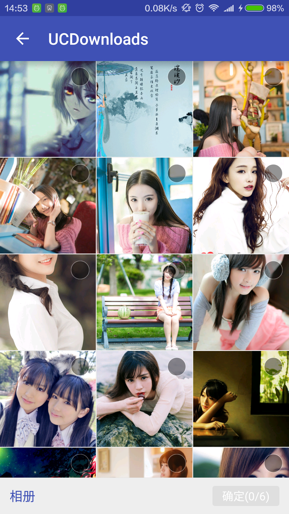

#ImagePicker
一个高仿微信、QQ图片选择库，支持单选，多选，预览，拍照。
#效果图
* 单选带相机


* 多选带相机

    
* 多选不带相机    


* 预览  


#使用说明
* 打开图库

```java
 public void btnClick(View view){
       Intent intent=new Intent(this,PhotoPickActivity.class);
       intent.putExtra(PhotoPickActivity.IS_SHOW_CAMERA,true);//是否显示相机,默认不显示
       intent.putExtra(PhotoPickActivity.MAX_PICK_COUNT,6);//最大可选择图片数，默认是1张，1张时，显示单选模式，具体看效果图
       intent.putExtra(PhotoPickActivity.SELECT_PHOTO_LIST,list);//上次选择的照片，
       startActivityForResult(intent,1234);
 }

```

* 接收选择的图片

```java
    @Override
    protected void onActivityResult(int requestCode, int resultCode, Intent data) {
        super.onActivityResult(requestCode, resultCode, data);
        if(resultCode!=RESULT_OK){
            return;
        }

        switch (requestCode){
            case 1234:
                List<String> list= data.getStringArrayListExtra(PhotoPickActivity.SELECT_PHOTO_LIST);//如果是单选，自己list.get(0),这个懒偷得，给自己满分。
                break;

         
        }
    }
```

#权限
```xml
    <uses-permission android:name="android.permission.READ_EXTERNAL_STORAGE"/>
    <uses-permission android:name="android.permission.WRITE_EXTERNAL_STORAGE"/>
```

#Thanks
图片加载使用了[**鸿洋博客中的imageloader**](http://blog.csdn.net/lmj623565791/article/details/38476887)

